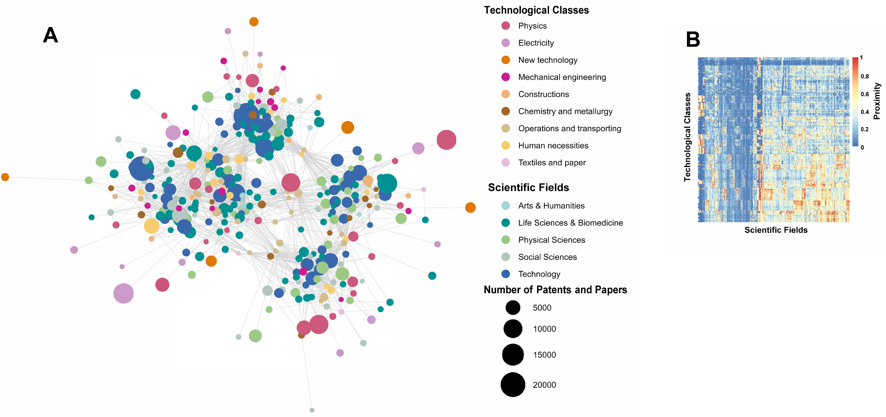
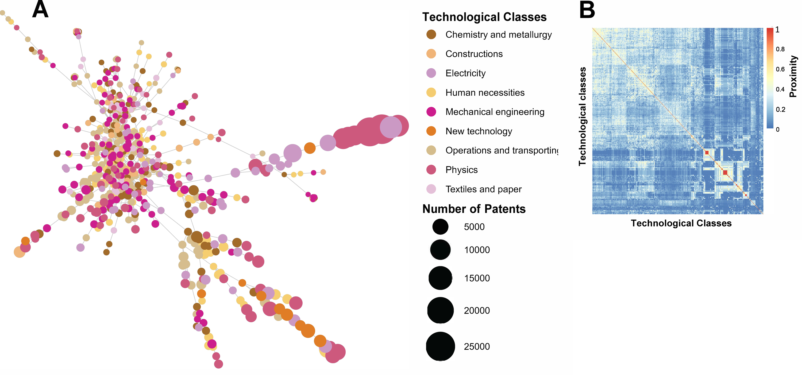
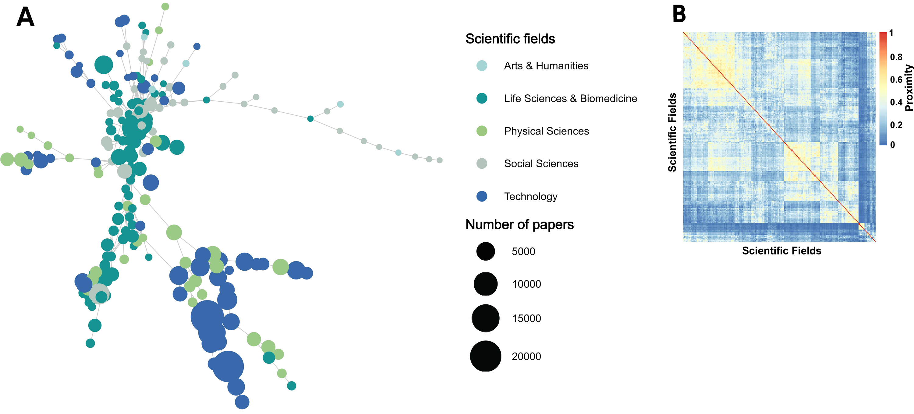

---

##### Download

+ [Paper](https://journals.plos.org/plosone/article?id=10.1371/journal.pone.0301091)

---

##### Abstract

This study investigates the factors influencing specialization in artificial intelligence (AI) technology, a critical element of national competitiveness. We utilized a revealed comparative advantage matrix to evaluate technological specialization across countries and employed a three-way fixed-effect panel logit model to examine the relationship between AI specialization and its determinants. The results indicate that the development of AI technology is strongly contingent on a nation’s pre-existing technological capabilities, which significantly affect AI specialization in emerging domains. Additionally, this study reveals that scientific knowledge has a positive impact on technological specialization, highlighting the necessity of integrating scientific advancements with technological sectors. Although complex technologies positively influence AI specialization, their effect is less pronounced than that of scientific knowledge. This suggests that in rapidly advancing fields, such as AI, incorporating new scientific knowledge into related industries may be more advantageous than simply advancing existing technologies to outpace competitors. This insight points nations toward enhancing AI competitiveness in new areas, emphasizing the vital importance of both scientific and technological capabilities, and the integration of novel AI knowledge with established sectors. This research offers critical guidance for policymakers in less technologically and economically developed countries, as these nations may not have the technological infrastructure required to foster AI specialization through increased technical complexity.

---

##### Figure 1: Science-technology knowledge space



##### Figure 2: Scientific knowledge space



##### Figure 3: Technological knowledge space



---

##### Citation

AI technology specialization and national competitiveness
Chun Y, Hur J, Hwang J (2024) AI technology specialization and national competitiveness. PLOS ONE 19(4): e0301091. https://doi.org/10.1371/journal.pone.0301091

```BibTeX
@article{PI04,
author = {Youngsam Chun, Jisoo Hur, and Junseok Hwang},
year = {2024},
title ={AI technology specialization and national competitiveness},
journal = {PLOS ONE},
volume = {19},
number = {4},
pages = {e0301091},
url = {https://doi.org/10.1371/journal.pone.0301091}}
```

